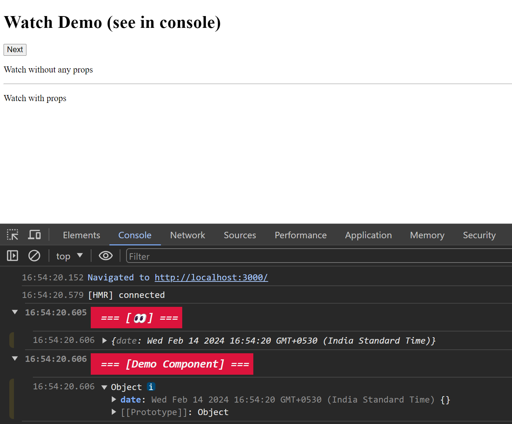
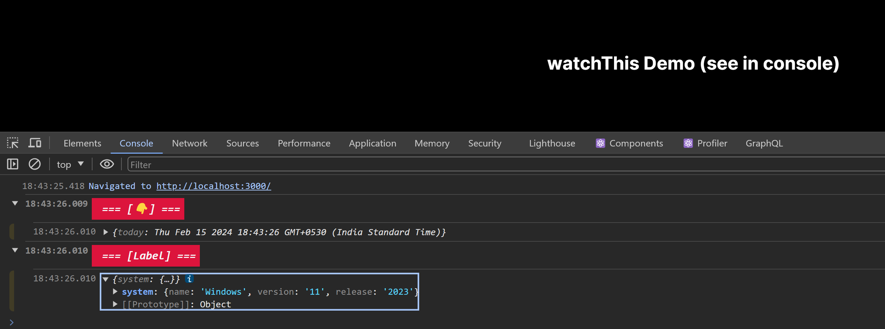
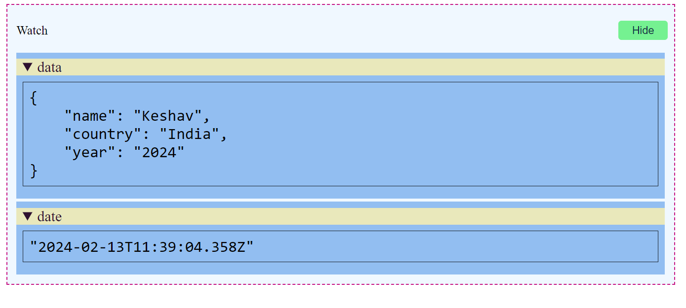
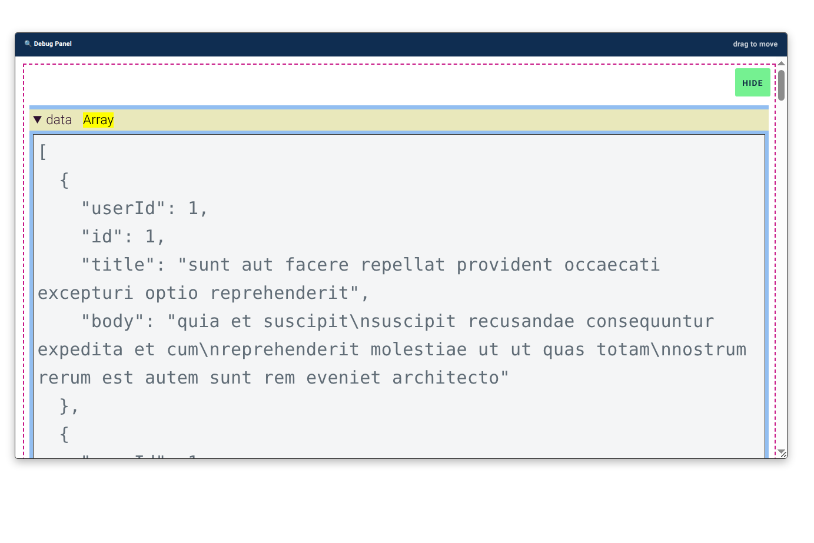

# @xkeshav/watch

![npm version][npm version]
![License][license]
![total download][download]

A developer friendly utility to watch data/variable runtime which help to debug React code fast( in console or within page)

This npm package comes with three variation to debug data within react application on runtime and async data

1. `<Watch>` component
2. `watchThis()` method
3. `<WatchJson>` component

## Installation

Install `@xkeshav/watch` via yarn or npm

```sh
> npm install @xkeshav/watch
```

or

```sh
> yarn install @xkeshav/watch
```

## Variations and usage

## `<Watch>` component

use `<Watch>` within JSX/TSX code to see the data in the console, and pass data as children

### Watch Syntax

```tsx
<Watch>{whateverDataToDebug}</Watch>
```

### props (optional)

| name         | type     | default      | description                                                        |
| ------------ | -------- | ------------ | ------------------------------------------------------------------ |
| `from`       | `string` | **👀**       | additional information to display in console                       |
| `kind`       | `string` | "log"        | console method such as `table` `dir` `warn` `error` `info` `trace` |
| `level`      | `number` | 1            | set level if large dataset to view in collapsed group view         |
| `color`      | `string` | "whitesmoke" | any valid color if user choice                                     |
| `background` | `string` | "crimson"    | any valid color if user choice                                     |

### Example

```tsx
import { useState } from "react";
import { Watch } from "@xkeshav/watch";

export const Demo = () => {
  const [date, setDate] = useState<Date>(new Date());
  const setNextHour = () => {
    const nextHour = date.getHours() + 1;
    setDate(new Date(date.setHours(nextHour)));
  };

  return (
    <div>
      <h1>Watch Demo (see in console)</h1>
      <button onClick={setNextHour}>Next</button>
      <p>Watch without any props</p> <Watch>{{ date }}</Watch>
      <hr />
      <p>Watch with props</p>
      <Watch from="Demo Component" kind="dir" color="orange">
        {{ date }}
      </Watch>
    </div>
  );
};
```

_Note: using object shorthand property within `Watch` for better readability._

### Output



---

## `watchThis()` method

use `watchThis()` method can be used in react component and it display data in the console.

### watchThis Syntax

```js
watchThis(whatToDebug);
watchThis(whatToDebug, "from filename", "info);
watchThis(whatToDebug, "additional details");
```

### Parameters (optional)

| name   | type     | default | description                                                         |
| ------ | -------- | :-----: | ------------------------------------------------------------------- |
| `what` | `string` |   ''    | pass data which need to display in console                          |
| `from` | `string` | **👇**  | additional information; this become title on console group          |
| `kind` | `string` |  "log"  | console method such as `table` `dir` `warn` ,`error` `info` `trace` |

### Example

```tsx
import { watchThis } from "@xkeshav/watch";

export const Demo = () => {
  const today = new Date();
  const system = { name: "Windows", version: "11", release: "2023" };
  watchThis({ today });
  watchThis({ system }, "Label", "info");
  return (
    <div>
      <h1>watchThis Demo (see in console)</h1>
    </div>
  );
};
```

### Output



## `<WatchJson />` component

This is another method to see output within the page, appears in a panel with show/hide button.

### WatchJson Syntax

```tsx
<WatchJson data={whatever} what={"some Title"} />
```

### Props (optional)

| name   | type      | default | description                                                     |
| ------ | --------- | ------- | --------------------------------------------------------------- |
| `what` | `string`  | ''      | this will be displayed as title of panel                        |
| `drag` | `boolean` | false   | when enabled the a draggable debug panel will be appear on page |

Note: we can pass as many as props to `WatchJson` (of any type )

### Example

```tsx
const WatchDemo = () => {
  const data = { name: "Keshav", country: "India", year: "2024" };
  return (<WatchJson what="Watch" data={data} date={new Date()} />;
};
```

### Output



when set `drag={true}`



## License

[**ISC**](https://github.com/xkeshav/watch/blob/main/LICENSE)

## References

- [_author_](https://twitter.com/xkeshav)
- [npm home](https://www.npmjs.com/package/@xkeshav/watch)
-

[license]: https://badgen.net/npm/license/@xkeshav/watch
[npm version]: https://badgen.net/npm/v/@xkeshav/watch
[download]: https://badgen.net/npm/dt/@xkeshav/watch
